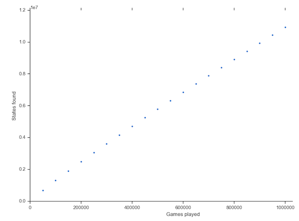

# Connect Four

[](https://travis-ci.com/camjw/connect_four)

[](https://codecov.io/gh/camjw/connect_four)


This repository is a Ruby implementation of the popular Connect Four game which
you can play in your terminal. It supports two player games, a very dubious one
player game and a (strange to watch) zero player game.

## Usage

The four necessary classes are the `board`, `player`, `randomai`, and `gameplay` classes.

```ruby
require "gameplay"

game = Gameplay.new   # Starts a new game
```

## Example game
The game interface is simple: just enter numbers from 1 to 7 to indicate the
column you want to play. The game won't allow invalid moves (i.e. if there are
already seven pieces in a column or if you enter a string which is not a number
from 1 to 7).


The winner is mildly congratulated:


There is an AI included which the player can play against but at the moment it
only plays by randomly choosing a valid column. It often misses winning moves.

Here we can see the AI missing two winning moves in one go!


## Random play

Connect Four is a complex game though, so making a decent AI is a challenge. The difficulty comes from the number of different legal states/positions the board
can be in. There are over 4 billion different states of Connect Four [[1]].

The `randomstatesearch` file plays games with two random AIs and returns all the
unique states it has found after a certain number of games. This happens in the `RandomStateSearch` class whose most important function is the `search_states`
function shown here:

```Ruby
def search_states(total_games, increment, target_file="rss_output.csv")
  output_array = []
  start_time = Time.now

  total_games.times { | num |
    play_game
    if num % increment == 0 && num > 0
      @states.uniq!
      time_taken = (((Time.now - start_time) * 100.0 ).to_i ) / 100.0
      output_array << { "Games played" => num, "States found" => @states.size,
        "Time taken" => time_taken }
      puts "Found #{@states.size} states after #{num} games
        and #{time_taken} seconds."
      output_array.to_csv(csv_filename="data/" + target_file)
    end
  }

  @states.uniq!
  final_time = (((Time.now - start_time) * 100.0 ).to_i ) / 100.0
  output_array << { "Games played" => total_games,
    "States found" => @states.size, "Time taken" => final_time }
  output_array.to_csv(csv_filename="data/" + target_file)
  puts "Found #{@states.size} states in total after #{final_time} seconds."

end

```

After playing 1,000,000 random games the AI has found 10,940,486 different
states, or around 11 per game.



The issue with using this approach to find all 4 billion states is that it takes
a very long time. Thanks to the calls to ` @states.uniq! ` the algorithm runs in exponential time.


## Next Steps

Make an AI which can compete with humans.


[1]: https://oeis.org/A212693
